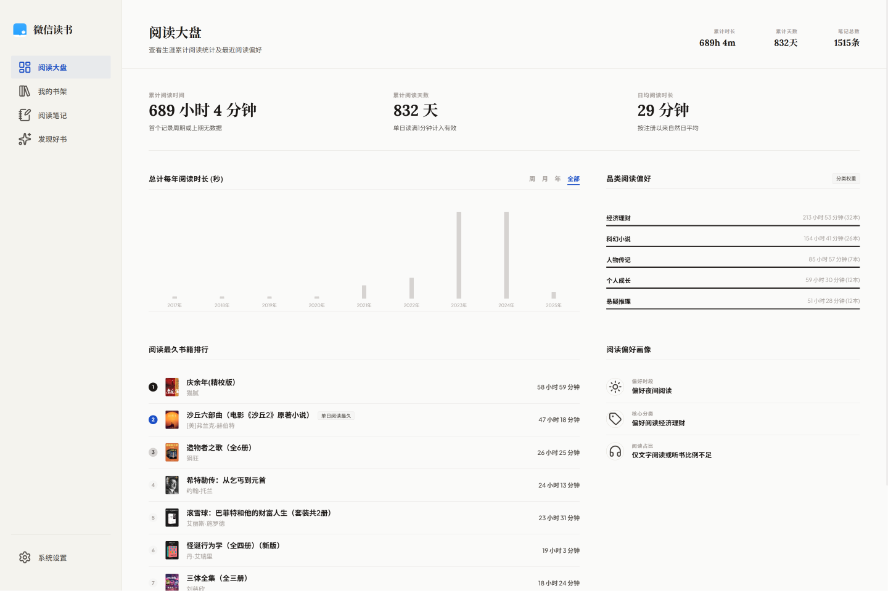
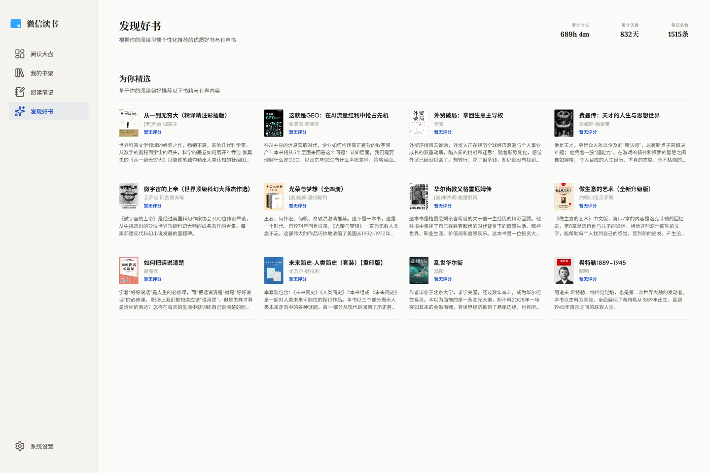
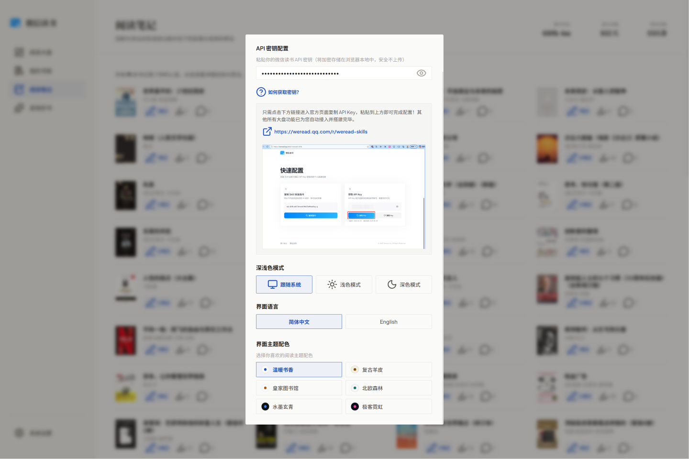

# WeChat Reading Stats Dashboard | 微信读书数据仪表盘

A gorgeous, minimalist, and responsive web console and dashboard for tracking, visualizing, and managing your WeChat Reading (WeRead) stats, bookshelf, notebooks, and discoveries. Built with a secure client-side encryption system and an Express-based CORS proxy server.

这是一个美观、极简且响应式的微信读书（WeRead）控制台和数据仪表盘，用于追踪、可视化及管理您的阅读数据、书架、笔记和推荐。内置安全的客户端加密系统，并通过 Express 代理服务器解决跨域与身份验证问题。

---

## English Version

### 🚀 Key Features

#### 1. Interactive Data Dashboard
Comprehensive visualization of your reading patterns and progress:
* **Multi-period Stats Toggle**: Seamlessly switch between *Weekly*, *Monthly*, *Annual*, and *Overall (Lifetime)* statistics to view your total reading duration, active days (days with at least 1 minute of reading), and daily averages.
* **Dynamic Time Charts**: High-performance interactive bar charts displaying detailed daily or monthly reading duration logs in seconds.
* **Category Preference Analysis**: Distribution chart/ratio showing your favorite book genres and reading categories with their respective weights.
* **Top Book Rankings**: Tracks and ranks your most-read books by active reading duration.
* **Habit Personas**: Automated profile analytics showcasing your preferred reading hours, core categories, and format ratios (text books vs. audio books).



#### 2. Full-featured Bookshelf Manager
A responsive visual grid to browse and filter your library:
* **Real-time Sync**: Direct synchronization with your official WeChat Reading bookshelf.
* **Advanced Search**: Instantly search your collection by book title or author name.
* **Category Filters**: Filter your library instantly by *All*, *In Progress* (currently reading), *Finished*, and *Secret* (private reading mode) books.
* **Visual Progress Bars**: View your precise reading completion percentage directly below each cover.

#### 3. Reading Notes Viewer
A clean, document-style reader to review and export your notes:
* **Notebooks Grid**: Displays a card for each book where you have added bookmarks, highlights, or custom thoughts.
* **Annotation Reader**: High-fidelity modal displaying your precise text highlights (划线) and associated annotations (想法), organized chronologically by book chapters.

#### 4. Smart Book Recommendations
Discover new hot releases, classics, and high-quality audio content:
* **Habit-based recommendations**: Tailored list of books and audio content based on your core category preferences and reading history.



#### 5. Premium Settings & Customization Panel
Tailor the application to your aesthetic and security preferences:
* **Client-Side Encryption**: Securely enter your WeChat Reading API key (`wrk-...`). The key is XOR-encrypted + Base64-encoded on the client side and saved in your browser's local storage. It is never uploaded or shared.
* **6 Curated Visual Themes**: Toggle between gorgeous custom themes designed for comfortable reading:
  * 🀄 *Classic Warm (温暖书香)*: Elegant cream aesthetic.
  * 📜 *Vintage Sepia (复古羊皮)*: Retro-newspaper tone.
  * 🏛️ *Royal Library (皇家图书馆)*: Sophisticated deep blue and gold.
  * 🌲 *Nordic Forest (北欧森林)*: Calm green accents.
  * ✒️ *Ebony Ink (水墨玄青)*: Dark graphite styling.
  * 🔮 *Cyberpunk Minimal (极客霓虹)*: Electric dark neon glow.
* **Smart Appearance modes**: Light, Dark, or automatic synchronization with your Operating System.
* **Bilingual UI**: Fully localized language switcher between English and Simplified Chinese.



---

### 📂 Project Structure
* `server.js`: Node.js Express server acting as a secure local CORS proxy to relay requests to the WeChat Reading gateway (`https://i.weread.qq.com/api/agent/gateway`).
* `public/`: The single-page frontend static assets:
  * `index.html`: Main semantic structure using modern Lucide icons.
  * `app.js`: Encrypted client state management, i18n switching, data transitions, and rendering.
  * `theme.css`: Declares design tokens, colors, and variables for the 6 custom themes.
  * `style.css`: Clean grid layouts, typography, modal transitions, and responsive styles.
* `.env`: Local environment configurations for the proxy server.
* `.env-example`: Template for creating the `.env` configuration file.

---

### ⚙️ Getting Started

#### Prerequisites
* [Node.js](https://nodejs.org/) (v16.0.0 or higher recommended)

#### Installation & Setup
1. Clone or download the repository to your local machine.
2. Install the lightweight dependencies:
   ```bash
   npm install
   ```
3. Create your local environment file:
   ```bash
   cp .env-example .env
   ```
   *(On Windows PowerShell, use: `Copy-Item .env-example .env`)*
4. Open the `.env` file and customize your port and default secret key (optional):
   ```env
   PORT=5001
   WECHAT_READ_SECRET="your-wechat-read-secret-key-here"
   ```
   *(Note: You can leave `WECHAT_READ_SECRET` blank and input your key securely through the frontend Settings modal at any time).*

#### Running the Application
Start the development server:
```bash
npm run dev
```
Open your browser and navigate to [http://localhost:5001](http://localhost:5001) (or your customized port) to explore your WeChat Reading console.

---
---

## 中文版

### 🚀 核心功能介绍

#### 1. 交互式数据阅读大盘
全面且生动地追踪并呈现您的阅读习惯与历史数据：
* **多维度统计周期**：支持一键切换“周”、“月”、“年”及“累计/生涯”数据，同步展示总阅读时长、有效阅读天数（单日阅读满1分钟计入有效）和日均阅读时长。
* **动态时长图表**：内置高性能的交互式柱状图，直观展现每日或每月的详细阅读时长（秒）。
* **品类阅读偏好**：多维度分析图表，清晰划分您的阅读品类偏好及对应的分类权重。
* **阅读时间最久书籍排行**：根据您在每本书上的实际阅读累积时间，生成直观的前几名排名。
* **阅读偏好画像**：基于数据智能分析并生成偏好阅读时段、核心品类倾向以及听书与电子书阅读的占比。


#### 2. 全功能我的书架
响应式网格布局，完美呈现您在微信读书中的所有藏书：
* **实时同步**：直观同步微信读书中的个人书架。
* **模糊搜索**：支持通过书名、作者等关键词进行秒级检索。
* **多状态分类检索**：支持一键切换“全部”、“在读”、“已读完”以及“私密阅读”分类。
* **阅读进度条**：在书籍封面下方清晰显示精准的阅读进度百分比。

#### 3. 互动阅读笔记提取
卡片式笔记本视图，回顾与整理阅读过程中的灵感闪现：
* **笔记本网格**：每本有划线或想法的书籍都将独立呈现为笔记本卡片，展示拥有的笔记总数。
* **高还原笔记阅览**：在专门的弹窗中，按书籍章节顺序清晰展现您的“划线原文”和与之关联的“读书想法”。

#### 4. 个性化发现好书
为您智能筛选并推荐新书、经典名著和高品质的有声读物：
* **基于习惯推荐**：根据您的阅读基因、品类倾向与历史阅读记录推荐专属图书。


#### 5. 极简精美的系统设置面板
高度自定义的隐私与视觉配置中心：
* **安全本地加密**：提供本地 API 密钥 (`wrk-...`) 配置。密钥在浏览器端采用异或与 Base64 进行双重加密并存储于 `localStorage`，绝不上传至任何第三方服务器。
* **6 款精心调配的视觉主题**：为满足不同环境下的舒适阅读，精心设计了 6 种配色方案：
  * 🀄 *温暖书香 (Warm)*: 护眼柔和的米白色。
  * 📜 *复古羊皮 (Sepia)*: 充满历史感的泛黄报纸色调。
  * 🏛️ *皇家图书馆 (Navy)*: 典雅尊贵的蓝金搭配。
  * 🌲 *北欧森林 (Sage)*: 清新自然、富含绿意。
  * ✒️ *水墨玄青 (Dark)*: 深邃的石墨黑灰夜间模式。
  * 🔮 *极客霓虹 (Cyber)*: 迷幻赛博朋克深色荧光风格。
* **智能深浅色切换**：支持“跟随系统”、“浅色模式”和“深色模式”。
* **中英双语界面**：提供完整流畅的中文和英文本地化一键切换。


---

### 📂 项目目录结构
* `server.js`：基于 Express 的后端 Node.js 代理服务器，自动附带 Bearer Token，安全转发请求至微信读书网关（`https://i.weread.qq.com/api/agent/gateway`），解决前端跨域限制。
* `public/`：前端静态文件目录：
  * `index.html`：采用语义化 HTML5 构建，并引入轻量化 Lucide 图标库。
  * `app.js`：负责客户端状态管理、安全加解密、国际化、数据呈现及弹窗切换。
  * `theme.css`：定义 6 套主题配色的 CSS 变量与设计系统。
  * `style.css`：精致的布局、网格系统、微动效及移动端响应式适配。
* `.env`：本地环境变量配置文件。
* `.env-example`：本地环境变量模板文件。

---

### ⚙️ 快速开始

#### 准备工作
* [Node.js](https://nodejs.org/) (推荐使用 v16.0.0 或更高版本)

#### 安装与配置
1. 克隆或下载本项目至本地。
2. 安装轻量依赖：
   ```bash
   npm install
   ```
3. 从模板创建您的本地 `.env` 文件：
   ```bash
   cp .env-example .env
   ```
   *（Windows PowerShell 用户请运行：`Copy-Item .env-example .env`）*
4. 打开 `.env` 文件并配置服务端口和默认密钥（可选）：
   ```env
   PORT=5001
   WECHAT_READ_SECRET="您的微信读书API密钥"
   ```
   *（提示：如果您留空，后续依然可以直接在前端界面的“系统设置”中输入并加密存储您的密钥）。*

#### 运行项目
启动本地代理与静态服务器：
```bash
npm run dev
```
在浏览器中访问 [http://localhost:5001](http://localhost:5001) 即可开始您的微信读书控制台探索之旅！
